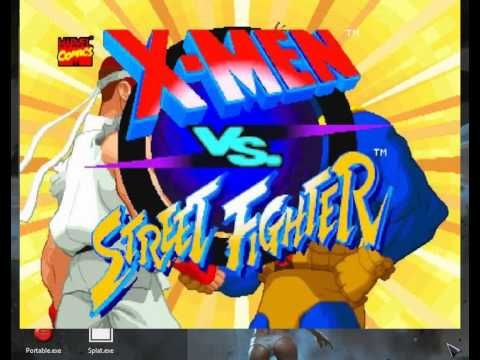

<!-- Common Project Tags:
command-line 
console-applications 
desktop-app 
desktop-application 
dotnet 
dotnet-core 
netcore 
netframework 
netframework48 
tool 
tools 
vbnet 
visualstudio 
windows 
windows-app 
windows-application 
windows-applications 
windows-forms 
winforms 
 -->

# SPLAT - Command-line app to display a custom splash screen 

### SPLAT can be used to show a splash screen, that is, to display an image for a short period of time before starting a external program.

The main idea behind **SPLAT** is to use it as part of any **WinRar** or similar self-extracting files, Batch-script files, a post-installation process of installer builders like Inno Setup, etc, to customize your packaging.

------------------

## 🖼️ Screenshots

## 🎦 Demo Video

See a recorded video by clicking on the following button:

 

## 📝 Requirements

- Microsoft Windows OS.

## 🤖 Getting Started

Download the latest release by clicking [here](https://github.com/ElektroStudios/SPLAT/releases/latest),

### Usage

#### Syntax:

    Splat.exe [IMAGE FILE] [SWITCHES]

#### Switches:

    /Duration   | The splash screen duration.    (Default: 5000 ms)
    /FXDuration | The visual effects duration.   (Default: 1500 ms)
    /FadeIN     | Enable FadeIN effect.
    /FadeOUT    | Enable FadeOUT effect.
    /Resize     | Set a new size for the image.
    /Location   | Set the position of the image on the current screen.
    /Clickable  | Enables doing click on the image to close it.
    /OnTop      | Set the image on top of other windows.
    /?          | Shows this help.

#### Switch value formats:

    /Duration   (ms)
    /FXDuration (ms)
    /Resize     (widthXheight)
    /Location   (X,Y)

#### Real world examples

    Splat.exe "C:\Image.png"
    (Shows a image at the center of the screen for 3000 ms.)

    Splat.exe "C:\Image.png" /Resize 400x400 /Location 100,300
    (Shows a resized image to 200x400 px at 100,300 coordenates for 3000 ms.)

    Splat.exe "C:\Image.png" /Duration 6000 /FadeIN /FadeOUT /FXDuration 2000
    (Shows a image at the center of the screen with fade effects for 6000 ms.
    , plus 2000 ms for each effect then is a total of 10.000 ms.)

## 🔄 Change Log

Explore the complete list of changes, bug fixes, and improvements across different releases by clicking [here](/Docs/CHANGELOG.md).

## 🏆 Credits

This work relies on the following technologies and libraries: 

 - [.NET Framework](https://dotnet.microsoft.com/en-us/download/dotnet-framework)

## ⚠️ Disclaimer:

This Work (the repository and the content provided in) is provided "as is", without warranty of any kind, express or implied, including but not limited to the warranties of merchantability, fitness for a particular purpose and noninfringement. In no event shall the authors or copyright holders be liable for any claim, damages or other liability, whether in an action of contract, tort or otherwise, arising from, out of or in connection with the Work or the use or other dealings in the Work.

This Work has no affiliation, approval or endorsement by the author(s) of the third-party libraries used by this Work.

## 💪 Contributing

Your contribution is highly appreciated!. If you have any ideas, suggestions, or encounter issues, feel free to open an issue by clicking [here](https://github.com/ElektroStudios/SPLAT/issues/new/choose). 

Your input helps make this Work better for everyone. Thank you for your support! 🚀

## 💰 Beyond Contribution 

This work is distributed for educational purposes and without any profit motive. However, if you find value in my efforts and wish to support and motivate my ongoing work, you may consider contributing financially through the following options:

 - ### Paypal:
    You can donate any amount you like via **Paypal** by clicking on this button:

    

 - ### Envato Market:
   If you are a .NET developer, you may want to explore '**DevCase Class Library for .NET**', a huge set of APIs that I have on sale.
   Almost all reusable code that you can find across my works is condensed, refined and provided through DevCase Class Library.

    Check out the product:
    
   

<u>**Your support means the world to me! Thank you for considering it!**</u> 👍
